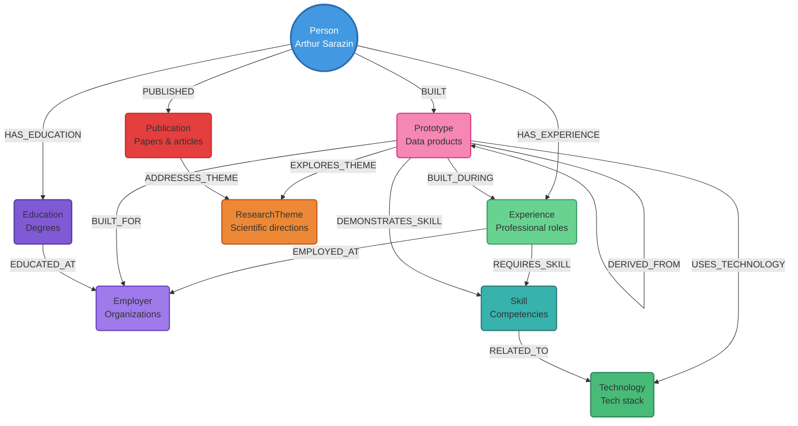

# Arthur Sarazin Portfolio Graph Model

## Model Schema (Mermaid)



## Design Constraints Applied

1. **No orphan nodes**: Every node has at least one relationship
2. **Core entity centered**: Person (Arthur Sarazin) is at the center of all queries
3. **Inter-entity zones prioritized**: Skill-Technology and Prototype-ResearchTheme connections enable discovery
4. **Space for relationships**: Graph layout designed for visual clarity
5. **End-to-end interpretability**: Navigation from Publications through ResearchThemes to Prototypes

## Instance Counts (Current Portfolio)

| Node Type | Count |
|-----------|-------|
| Person | 1 |
| Experience | 4 |
| Employer | 7 |
| Prototype | 25+ |
| Skill | 5 |
| Technology | 5 |
| Education | 2 |
| ResearchTheme | 3 |
| Publication | 3 |

## Key Traversal Patterns

### "What skills led to this prototype?"
```cypher
MATCH (p:Prototype {name: "Inside LLMs Mind"})
      -[:DEMONSTRATES_SKILL]->(s:Skill)
RETURN s.name
```

### "What research themes connect these prototypes?"
```cypher
MATCH (p1:Prototype)-[:EXPLORES_THEME]->(t:ResearchTheme)
      <-[:EXPLORES_THEME]-(p2:Prototype)
WHERE p1 <> p2
RETURN p1.name, t.name, p2.name
```

### "Show career progression through technology adoption"
```cypher
MATCH (e:Experience)-[:EMPLOYED_AT]->(emp:Employer),
      (proto:Prototype)-[:BUILT_DURING]->(e),
      (proto)-[:USES_TECHNOLOGY]->(tech:Technology)
RETURN e.title, emp.name, collect(tech.name) as technologies
ORDER BY e.startDate
```
